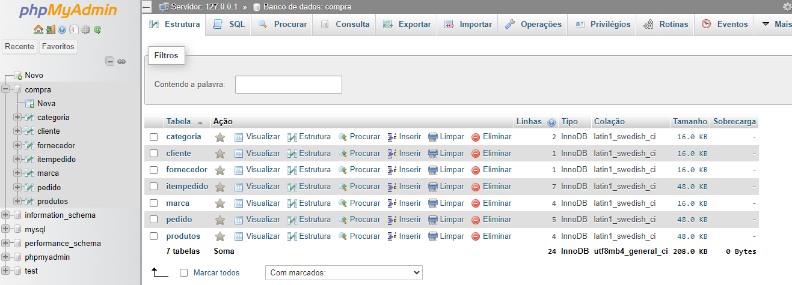
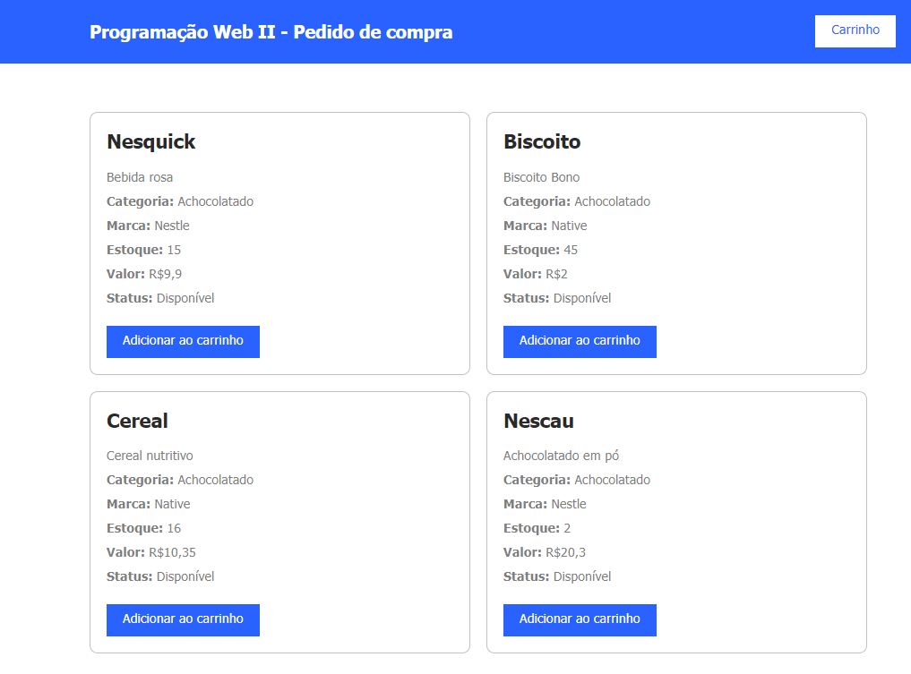
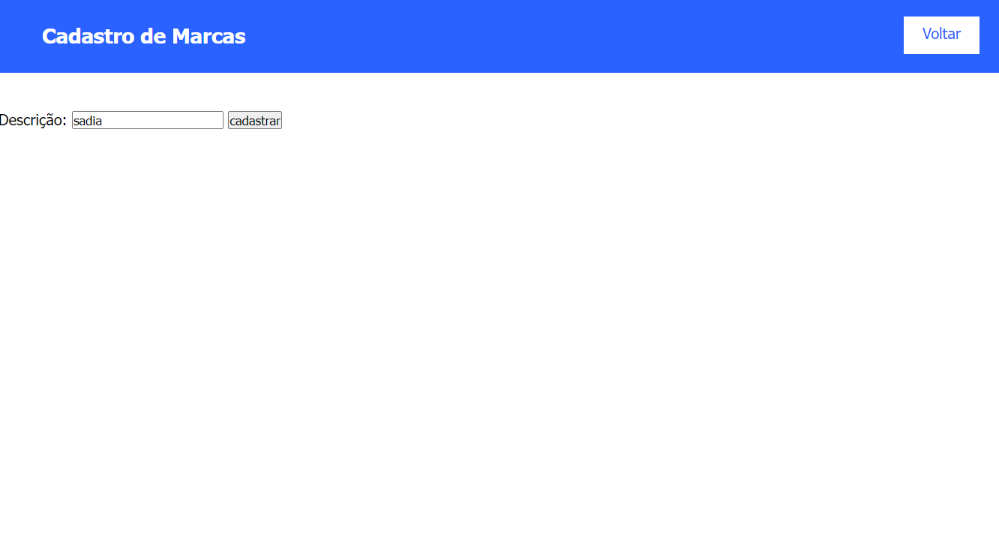

# CadEcommerce

## Projetos Web

Aplicações web utilizando HTML, CSS, JavaScript e PHP.

## Estrutura da página



## Estrutura

- **HTML**: Layout das páginas.
- **CSS**: Estilos das páginas.
- **JavaScript**: Funcionalidades interativas.
- **PHP**: Backend para manipulação de dados.

## Projetos

### 1. Carrinho de Compras

Aplicação web para gerenciar um carrinho de compras.

#### Arquivos

1. `index.php`: Página principal do carrinho.
2. `css/style.css`: Estilos.
3. `js/jquery-2.1.4.min.js`: jQuery.
4. `js/script.js`: Scripts personalizados.
5. `controller/carrinho-busca.php`: Busca de produtos.

#### Execução

1. Clone o repositório.
2. Use um servidor web com PHP.
3. Coloque os arquivos no servidor.
4. Acesse `index.php`.

---

### 2. Cadastro de Categorias

Aplicação web para cadastrar categorias.


#### Arquivos

1. `index.php`: Formulário de cadastro.
2. `css/style.css`: Estilos.
3. `insere-categoria.php`: Cadastro de categoria.

#### Execução

1. Clone o repositório.
2. Use um servidor web com PHP.
3. Coloque os arquivos no servidor.
4. Acesse `index.php`.

---

### 3. Pedido de Compra

Aplicação web para gerenciar pedidos de compra.



#### Arquivos

1. `index.php`: Página de produtos.
2. `css/style.css`: Estilos.
3. `js/jquery-2.1.4.min.js`: jQuery.
4. `js/script.js`: Scripts personalizados.
5. `controller/produtos-busca.php`: Busca de produtos.
6. `carrinho.php`: Página do carrinho.

#### Execução

1. Clone o repositório.
2. Use um servidor web com PHP.
3. Coloque os arquivos no servidor.
4. Acesse `index.php`.

---

### 4. Cadastro de Marcas

Aplicação web para cadastrar marcas.




#### Arquivos

1. `index.php`: Formulário de cadastro.
2. `css/style.css`: Estilos.
3. `insere-marca.php`: Cadastro de marca.

#### Execução

1. Clone o repositório.
2. Use um servidor web com PHP.
3. Coloque os arquivos no servidor.
4. Acesse `index.php`.

---

### 5. Resumo de Pedido

Aplicação web para mostrar o resumo de um pedido.

#### Arquivos

1. `index.php`: Página do resumo.
2. `css/style.css`: Estilos.
3. `js/jquery-2.1.4.min.js`: jQuery.
4. `js/script.js`: Scripts personalizados.
5. `controller/produtos-resumo.php`: Resumo do pedido.

#### Execução

1. Clone o repositório.
2. Use um servidor web com PHP.
3. Coloque os arquivos no servidor.
4. Acesse `index.php`.

---

### 6. Cadastro de Produtos

Aplicação web para cadastrar produtos com seleção de categoria e marca.

#### Arquivos

1. `index.php`: Formulário de cadastro.
2. `css/style.css`: Estilos.
3. `insere-produto.php`: Inserção de produto.
4. `controller/conexao.php`: Conexão com o banco de dados.

#### Execução

1. Clone o repositório.
2. Use um servidor web com PHP e MySQL.
3. Coloque os arquivos no servidor e configure o banco de dados.
4. Acesse `index.php`.

---

## Métodos PHP

### `mysqli`

- **Descrição**: `mysqli` é uma extensão do PHP que permite a interação com bancos de dados MySQL. Ele oferece uma interface melhorada e mais segura em comparação com a extensão `mysql`, que é mais antiga e está obsoleta.

### `mysqli_query`

- **Descrição**: `mysqli_query` é uma função do PHP utilizada para executar consultas SQL em um banco de dados MySQL. Essa função é parte da extensão MySQLi (MySQL Improved), que é uma melhoria da antiga extensão `mysql` e fornece uma interface mais segura e eficiente para interagir com bancos de dados MySQL.
- **Exemplo de uso**:
    ```php
    $result = mysqli_query($conn, $sql);
    if ($result) {
        // Processar os resultados
    } else {
        echo "Erro: " . mysqli_error($conn);
    }
    ```

### `mysqli_close`

- **Descrição**: `mysqli_close` é uma função no PHP que encerra uma conexão previamente aberta com um banco de dados MySQL. Ela é usada para liberar os recursos associados à conexão e fechar a comunicação com o servidor de banco de dados.
- **Exemplo de uso**:
    ```php
    mysqli_close($conn);
    ```

### `mysqli_error`

- **Descrição**: `mysqli_error` retorna uma string contendo a descrição do erro mais recente ocorrido na conexão ou na operação MySQLi.
- **Exemplo de uso**:
    ```php
    if (!$result) {
        echo "Erro: " . mysqli_error($conn);
    }
    ```

## Sites consultados

- [Documentação do PHP: mysqli_close](https://www.php.net/manual/pt_BR/mysqli.close.php)
- [Como se conectar ao MySQL usando PHP](https://www.godaddy.com/pt-br/help/como-se-conectar-ao-mysql-usando-php-216)
- [Como inserir dados no MySQL com PHP](https://www.hostinger.com.br/tutoriais/como-inserir-dados-no-mysql-com-php)
